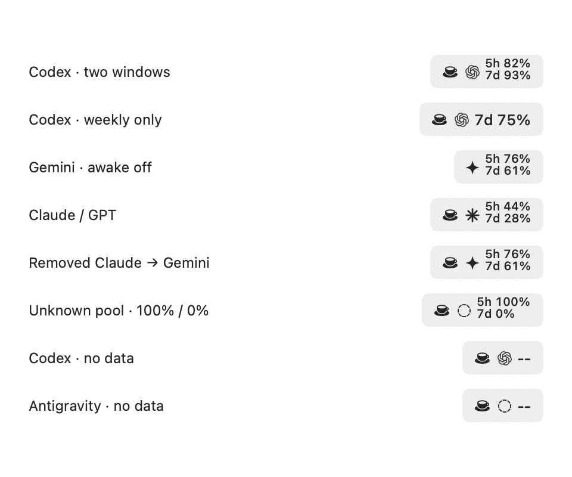
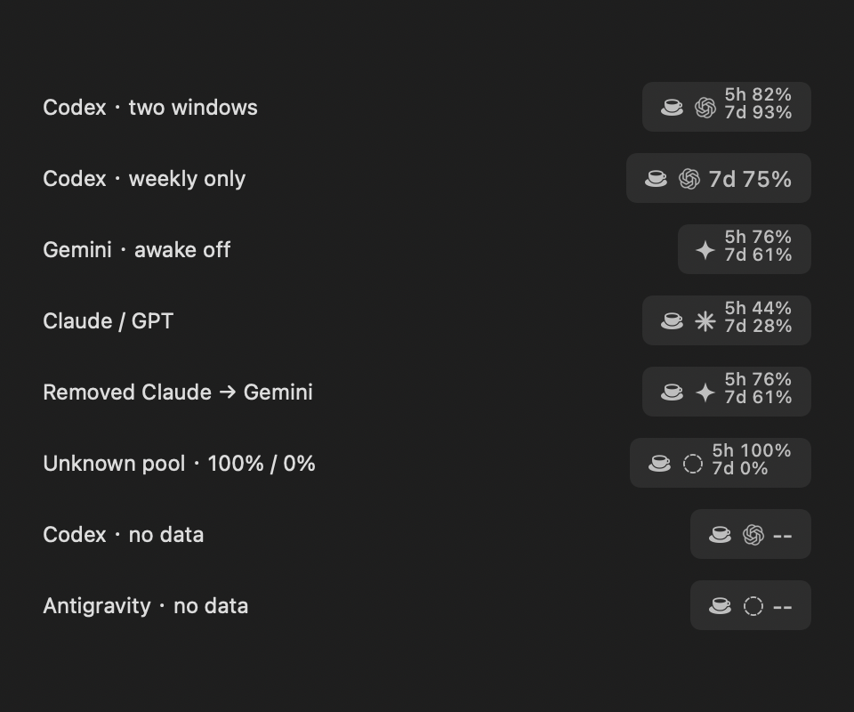

# Menu bar presentation follow-up · 2026-09-11

Status: pre-release validation record for 2.0.11 (28). The checks below describe
the source candidate; installation and release delivery are recorded separately.

## Scope

Continues the review of the user's Antigravity menu bar and settings changes.
Preserves the user's uncommitted compact menu bar and settings design.

- Core/MenuBarPresentation.swift resolves effective provider, actual group, icon,
  quota lines and accessible description together. Missing selections use the
  existing group fallback; unknown or absent Antigravity groups get a neutral icon.
- App/Support/MenuBarStatusRenderer.swift holds the existing AppKit icon/composite
  drawing, shared by AppDelegate, SettingsView and DesignPreviewView. The menu bar's
  22 pt height, 10/12.5 pt fonts, 4 pt spacing and coffee-left ordering are retained.
- Settings no longer substitutes fixed percentages for missing snapshots. Its
  preview uses the same image and accessible description as the status item.
- Known settings groups use Gemini / Claude / GPT labels (two choices: Gemini and
  Claude / GPT). The existing both-windows option is now All available quotas /
  全部可用额度. Picker accessibility labels are explicit.
- Preview entry points compile the shared Support file and receive an isolated
  preview StayAwakeStore. Xcode source membership includes both shared files.
- No new timer, polling, file scan, provider request or store persistence was added.
  Token M/B formatting and cache counting are unchanged.

## Verification

1. Core tests: 68 tests passed, including selected/missing/unknown groups, empty
   snapshots, disabled/unavailable provider fallback, absent 5h windows and
   Stay Awake/accessibility state. The first fixture compile attempt omitted two
   required UsageSnapshot initializer arguments; corrected before the passing run.
2. Main App: final Debug build succeeded with signing disabled and separate derived
   data at build/MenuBarFix20260911. No candidate main App was launched.
3. Interactive preview: script --preview settings menuBar light compiled and
   launched the isolated QuotAIPreview bundle. CUA exercised Codex → Antigravity,
   Gemini → Claude / GPT, both windows → 7d only → both windows.
4. Native readback: the preview image's accessibility description followed
   Gemini 76%/61%, Claude 44%/28%, and Claude weekly-only 28% correctly.
   Final screenshot showed complete Claude / GPT and All available quotas labels,
   no scroll bar, and no clipping. These are synthetic preview values, not account data.
5. Offline native-image matrix: eight states inspected in light and dark, including
   100%/0%, a removed selection, neutral unknown group and both no-data states.
6. Renderer compilation succeeded via --render-preview. ImageRenderer correctly
   draws the shared image, but cannot draw native popup controls: the standalone
   Settings PNGs contain unsupported-control placeholders. They are NOT accepted
   as full-settings screenshots. Picker acceptance instead uses the actual preview
   window and its CUA screenshots from this conversation.
7. git diff --check, bash -n, project plist and English/Chinese strings lint passed.

No final installed-app/menu-bar interaction, non-Retina, multi-display, VoiceOver
speech, Universal release signing or long-running energy measurements are claimed.
The existing /Applications/QuotAI.app executable stayed unchanged during this task.

## Repeatable entry points

From the repository root:

```sh
swift test
./script/build_and_run.sh --preview settings menuBar light
./script/build_and_run.sh --render-preview en light antigravity
./script/build_and_run.sh --render-settings zh-Hans dark antigravity menuBar
```

After --render-preview builds the renderer, its --menubar-matrix flag renders the
eight synthetic states; add --dark for the dark variant. Settings-only flags
--settings --menu-bar, --ag-claude and --sparse select the reviewed scenarios.
The renderer is an existing command-line image-export utility; the interactive
preview is launched as a separate .app with its own preferences domain.

## Local evidence

- Logs: build/menubar-fix-20260911/{tests,main-build,render-build,interactive-preview}.log
- Pre-edit copies of affected existing files: build/menubar-fix-20260911/before/
- Shared-image matrices below are current-run synthetic renders, not installed-app screenshots.





Next delivery step, only with user authorization: version bump, release packaging,
installed-app readback and relevant native checks, then GitHub release publication.
